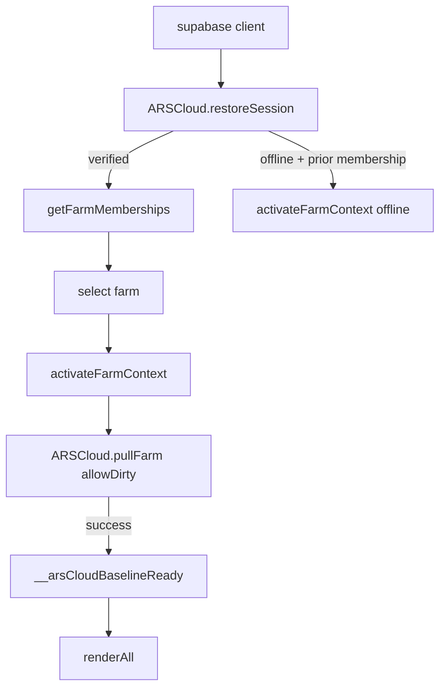

# ARSwineTech Pro — Reverse-Engineered Architecture

This document reconstructs the application from the committed sources: how it
boots, how it stores data, and – most importantly – the **exact multi-device
cloud-sync protocol**, plus the domain algorithms (gestation, feed forecast,
piglet ledger pools, finances, genetics).

---

## 1. Technology & deployment

| Layer | Choice |
|---|---|
| Shell | Hand-rolled static PWA (no framework/build step). `index.html` + 40 classic `<script>` files in a fixed load order |
| Style | Single `app.css` (~6 k lines), dark/light theme via `html.light-theme` |
| Backend | **Supabase** (PostgREST + Auth). Config in `supabase/config.js` (publishable key only) |
| Persistence | `localStorage` (`arswine-db-v1` = whole `window.DB` JSON) + IndexedDB snapshot (`arswinetech-device` / `snapshots`) + in-memory `window.DB` |
| Sync | Custom dirty-record engine in `supabase/client.js` (`ARSCloud`) + background auto-sync in `js/cloud-sync.js` |
| Offline | Service worker `sw.js` (network-first for code, cache-first for media) |
| Extra capabilities | Web Bluetooth printers/scales, QR/ZXing barcode, file exports, printable certificates |

**Deployment layout expected by the code** (this is what a host must serve):

```
/
├── index.html
├── manifest.webmanifest
├── sw.js, register-sw.js, _headers
├── css/app.css
├── js/*.js            (all modules)
├── supabase/config.js, supabase/client.js
├── assets/arswinetech-logo.png, semen-bottle.png
└── icons/icon-192.png, icon-512.png
```
> ⚠️ The repository currently stores everything at the root — see
> `VALIDATION-REPORT.md` §C1 and `qa/build-deploy-layout.sh`.

---

## 2. Module map (load order matters)

`index.html` loads in this order; later files intentionally override/wrap earlier globals
(e.g. `renderAll`, `getPigletCounts`, `calculateCompatibility`).

```
supabase/config.js        → ARS_SUPABASE_CONFIG (url, anonKey, app version)
supabase/client.js        → window.ARSCloud  (auth + dirty-record sync engine)
js/app.js                 → STORE, DB, F(), save(), date helpers (TODAY/d/isoOff/days),
                            status(), dashboard, feedForecast, production(), login/onboard,
                            activateFarmContext, finishAuthenticated, adminPage
js/reminder-engine.js     → reminder center + due alerts (overrides reminders page)
js/sow-tools.js           → sow profile, heat/insemination shortcuts, deleteRecord
js/pedigree.js            → pedigree trees + compatibility() (inbreeding engine)
js/lineage.js             → linked insemination (breedingRecords, semen→boar lineage)
js/sidebar.js             → nav grouping
js/registration-security.js → tenant guard wrappers
js/drilldown.js           → sow/batch drill-downs, weaning, gestation progress
js/modal-layer.js         → generic modal helpers
js/medicine.js            → basic medicine page
js/piglet-ledger.js       → counts() — THE authoritative herd arithmetic,
                            batch hub, allocations, mortality, care quick-actions
js/foster-batch.js        → cross-fostering
js/ble-scale.js           → Bluetooth scale streaming
js/batch-performance.js   → weights, ADG, ear-notch roster
js/reservations.js        → reservation CRUD, floating waitlist, release
js/cull.js                → sow culling
js/logo-custom.js         → farm logo
js/reservation-summary-edit.js / reservation-certificate.js → certificates
js/semen-sales.js         → semen POS, returns, payments, resellers, BLE printing
js/vet-library.js         → veterinary reference
js/medicine-inventory.js  → medicine stock, expiry, deductions
js/ai-vet-search.js       → AI vet lookup (edge function)
js/boar-registry.js       → boar profiles
js/fattener-center.js     → grow-finish + selling
js/feeding-guide.js       → feeding program per stage
js/feed-orders.js         → ordering tracker
js/piglet-care.js         → iron/castration care window
js/vaccination-center.js  → vaccination program
js/zxing.min.js           → barcode reader
js/rfid-scanner.js        → RFID/BLE/NFC scanner UI
js/barn-movements.js      → barns + movements
js/sow-monitoring.js      → dashboard health chips, 16/21-day monitoring
js/farm-admin.js          → farm deletion (platform)
js/invite-share.js        → invitation codes
js/financial-statements.js→ ARSFinance (statements; wraps renderAll)
js/production-control.js  → ARSProduction (events, feed allocations, KPIs;
                            hooks ARSProductionOnSave)
js/collapsible-content.js, batch-delete.js
js/cloud-sync.js          → background auto-push/pull engine, sync indicator,
                            backup modal (wraps window.save at init)
js/register-sw.js         → registers sw.js
```

---

## 3. Boot sequence

```
HTML loads → supabase/config + client → app.js eagerly evaluates:
  1. STORE shim; farmId from localStorage
  2. DB = load('arswine-db-v1')  → unifyAndRestoreRealHerd()
  3. (modules) — everything hooks globals
DOMContentLoaded → bootApp() → startApp():
  4. IndexedDB recovery snapshot fills DB only if localStorage empty
  5. ARSCloud.restoreSession():
       - validates persisted/legacy token against /auth/v1/user
       - refreshes when expired; offline → {verified:false, offline:true}
  6. verified → finishAuthenticated():
       a. getFarmMemberships()          (RLS-filtered)
       b. isPlatformAdmin()             (server email check)
       c. platform admin → listFarms()  (all farms; non-admin → memberships only)
       d. select active farm; save orphaned local buckets as recovery snaps
       e. activateFarmContext(farmId):
            - arsContextReady = true, __arsCloudBaselineReady = false
            - ARSCloud.pullFarm(farmId, {allowDirty:true})
              → replaces local bucket with cloud-authoritative rows
              → sets __arsCloudBaselineReady = true
  7. body.farm-access-granted → renderAll()
  8. cloud-sync.js: scheduleAutoPush / performBackgroundPull(true) at +1.2 s,
     visibility/focus/online listeners, 18 s heartbeat poll
```

**Security model:** access is granted only after Supabase returns a verified
session **and** an active membership (RLS). A local `ars-auth` flag is never
trusted. `isSuperAdmin` additionally requires the *server* `is_platform_admin`
RPC. Offline mode is allowed only from a previously validated user/farm and is
visibly labelled "Offline", never "Synced".

---

## 4. The sync engine (multi-device)

### 4.1 Cloud schema (single table, used by every entity)

```
app_records(
  farm_id     text,      -- tenant key (RLS scoping)
  entity_type text,      -- 'sow','piglet_batch','transaction','semen_inventory',
                         -- 'feed_inventory','reminder','reservation','pos_sale', … (~40 types)
  local_id    text,      -- stable per-row business key, e.g. 'S-001', 'feed-grower',
                         -- 'tx-…',  or synthetic '_ars_cloud_local_id'
  payload     jsonb,     -- the full row
  updated_at  timestamptz,  -- conflict version (client-set)
  updated_by  uuid|null
)
UNIQUE (farm_id, entity_type, local_id)  -- upsert via
POST .../app_records?on_conflict=farm_id,entity_type,local_id
     Prefer: resolution=merge-duplicates,return=minimal
```

### 4.2 Local state

```
window.DB = { [farmId]: farmBucket }     // whole farm, in memory
localStorage 'arswine-db-v1'             // same JSON (fast UI restore)
IndexedDB 'arswinetech-device' → 'farm-data-v1'   // durable same-device snapshot
dirtyVersions: Map<'farmId:::type:::localId', count>   // rows edited since baseline
cloudVersions: Map<key, {updated_at}>    // last KNOWN remote version (baseline)
__arsCloudBaselineReady / __arsContextReady / __arsPendingUnverifiedSave
__arsLastSavedFarmById[farmId]           // previous snapshot for change detection
__arsDirectCloudVerification             // lock counter for direct saves
```

### 4.3 Change detection (`save()` → `markLocalChanges`)

1. Compare each entity array of the previous snapshot vs the current bucket.
2. Rows without any business id get a **synthetic `_ars_cloud_local_id`**
   (`type-Date.now()-index-rand`) — persistent per row, so index drift is not a
   problem in the current build.
3. Key = `localIdFor(row)` = `_ars_cloud_local_id || id || no || tag || code || name`.
4. Any added/changed row → dirty key. **Deletions are NOT auto-pushed** (explicit
   `deleteAppRecord` calls only).
5. Special farm rows: `farm_logo`, `feed_plan` (`config`), `farm_settings`.

### 4.4 Push (`pushFarm`, dirty-only)

```
guard: token? farm context? __arsCloudBaselineReady?
rows = buildRows(farm, dirtyKeys)         // payloads + fresh updated_at + local_id
preflight = listFarmRows()                // re-read server state
for each dirty row:
  remote = server row; baseline = cloudVersions.get(key)
  if remote && (!baseline || remote.updated_at > baseline.updated_at)
      → CONFLICT: whole push aborts, zero rows written, reason + conflicts[]
chunked POST (50/req) → on success clear dirty keys
        (version-guarded against concurrent edits during upload)
```

Threading: direct saves use `verifyFarmSave` under a counter; the debounced
auto-push yields while a direct verification is in flight; only one background
sync runs at a time (`isSyncingInProgress`).

### 4.5 Pull (`pullFarm`)

```
guard: token, same farm context, no dirty rows (unless allowDirty)
readVersion = localMutationVersion       // re-check after network read
serverMeta = getFarmMeta()               // farm name/logo
rows = listFarmRows()                    // paginated 1000/page, count=exact,
                                         // aborts if incomplete
if local mutation occurred during read → discard, return pending
bucket = entity → [payloads…]; strip transient sync markers on
         semen_reseller_tx
farm_logo / feed_plan('config' canonical) / farm_settings → special fields
saveLocalRecovery(before)                 // never auto-uploaded
f[key] = bucket[key] (cloud-authoritative REPLACE)
dirtyKeys(farmId) → cleared; cloudVersions ← nextVersions
__arsCloudBaselineReady = true; persist localStorage + IndexedDB; renderAll
```

### 4.6 Background engine (`cloud-sync.js`)

* `save()` → `scheduleAutoPush(750 ms)` → push when online + baseline verified.
* 18 s heartbeat / visibility / focus → `performBackgroundPull(false)` — skipped
  while dirty (protects local edits), skipped while a form modal is open, but
  refreshable search fields and open drill-downs/batch hubs are re-rendered.
* Indicator states: `synced / syncing / pending / offline / error`.
* Failure policy: conflict → **stop** (no auto-retry, "Review needed");
  transient error → retry in 12–15 s; `allowDirty` pull is the only manual
  resolution path (see VALIDATION-REPORT C2).

### 4.7 Multi-device behavioural guarantees (verified)

| Guarantee | Mechanism |
|---|---|
| No unverified upload | `__arsCloudBaselineReady` gate |
| Last-writer-wins only when both devices are at the same version | `updated_at` preflight vs stored baseline |
| Local work never silently overwritten by a pull | dirty gate (unless `allowDirty`) |
| Stale device cannot resurrect a newer edit | conflict abort |
| No duplicate feed rows | upsert on `(farm,type,local_id)` |
| No index-drift duplicates | persistent `_ars_cloud_local_id` |
| Cross-device delete | explicit `DELETE` by primary key |
| Limited trust in client timestamps | ⚠️ conflict detection uses client `updated_at`; a device with a slow clock can silently overwrite — see roadmap (use server versions / integer monotonic `rev`). |

---

## 5. Domain algorithms (as implemented)

### 5.1 Sow lifecycle
* Gestation = 114 days from insemination (`due = insemination + 114`).
* `status()`: Culled → Reheat → Heat → Open (no insemination) → Lactating
  (farrowed & weaned-at absent) → Inseminated (`<33 d`) → Pregnant (`≥33 d`).
  `days()` rounds; `drilldown.realDays()` floors (see M3).
* 16/21-day post-AI monitoring = `d ∈ [15,24]` to cover the window.

### 5.2 Piglet ledger pools (authoritative `counts()`)
```
alive(g)  = born(g) − mortality(g) − sold(g)
pool(g)   = assigned(g) − sourceMortality(g) − sourceSold(g)
            − unattributedMortality (drained Fattener→Breeder→FarmUse)
            capped by alive(g)
available(g) = alive(g) − Σpool(g) − unassignedReserved(g)
```
Reservation → `reserved` row (source pool); cancellation → `cancel_reservation`
(row kept); release → `sold` row + balancing `cancel_reservation`
(so heads are never both Reserved and Sold). Floating reservations do **not** touch
the ledger until allocated.

### 5.3 Feed forecast (`feedForecast(period)`)
```
today's population: piglets by age stage (≤30 PreStarter, ≤70 Starter,
                    ≤120 Grower, else Finisher), sows (Lactating ≥110 d gestation
                    or farrowed, else Gestating) + active boars → Gestating
daily loop (period days): advance ages; stage transitions;
                    PreStarter 0.35 kg/h/d, Starter 1.10, Grower 2.10,
                    Finisher 2.75, Gestation 2.5, Lactation 3.5 (configurable)
demand bags = kg / bagKg (25 kg PreStarter, 50 kg others)
coverage: daysOfStock = stockBags / dailyBurnBags; shortfall = ceil(req−stock)
```
**Limitations:** no new litters are added when a sow farrows inside the horizon;
piglets aged 0–4 d are shown as consumers "today" but not simulated; sold/released
heads are subtracted per batch; no seasonality/mortality forecast.

### 5.4 Financial statements (`ARSFinance`)
* Source: `transactions` + `sales` mirror (dedup by id or signature) minus
  void/deleted/undone.
* Customer deposits (regex category/description + reservation lookup) held as
  liabilities, excluded from operating revenue.
* Mortality expense = `max(transaction mortality, ledger loss)` — no double count.
* Operating expense classes: Feed, Utilities, Labor, Vet, Interest, Mortality,
  Other. Capital/loan/equity flows are non-operating; cash-flow statement splits
  operating/investing/financing; balance sheet uses `cash = netChange` with an
  assumed zero opening balance; biological assets only when explicit book values
  exist.

### 5.5 Genetics (`pedigree.js compatibility`)
Wright's coefficient: `F = Σ 0.5^(n1+n2+1) · (1 + F_ancestor)` over all
recorded common-ancestor paths (depth 3), preceded by hard rules:
parent↔offspring 25% **block**, full-sib 25% **block**, half-sib 12.5%,
grandparent 12.5% **block**, uncle/aunt 6.25%. Only the `blocked` flag should be
trusted by callers (FIX 29).

### 5.6 Vaccination & medicine
* Dose prep = heads × dose/ml; deduction from medicine stock with min-stock
  warnings; expiry-day counts; batch-level heads use `born − mortality`
  (⚠️ see M1).

---

## 6. Data-flow diagrams

### Boot & context activation


### One save → both devices
```mermaid
sequenceDiagram
  participant D1 as Device 1
  participant S as Supabase
  participant D2 as Device 2
  D1->>D1: save() → markLocalChanges → dirty keys
  D1->>D1: scheduleAutoPush(750ms) → pushFarm(dirtyOnly)
  D1->>S: listFarmRows (preflight, count=exact)
  S-->>D1: rows + content-range
  D1->>S: POST app_records?on_conflict=… (≤50/chunk)
  S-->>D1: 201; dirty keys cleared
  D2->>S: lists/poll 18s → pullFarm (no dirty)
  S-->>D2: rows
  D2->>D2: replace bucket; renderAll; refresh open drill/batch hub
```

### Conflict (same row, two devices)
```mermaid
sequenceDiagram
  participant D1, participant S, participant D2
  D1->>S: push edit A (baseline T0, remote T0) → OK (T1)
  D2->>S: push edit B (baseline T0) → preflight sees T1 > T0
  S-->>D2: conflicts:[{key, remote_updated_at}]
  D2->>D2: success=false, dirty preserved, indicator 'error/Review needed'
  Note over D2: No review UI; only allowDirty pull silently replaces local value
```
